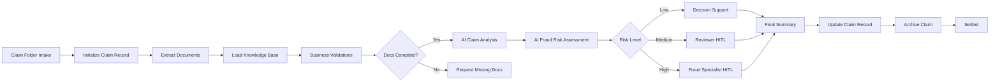
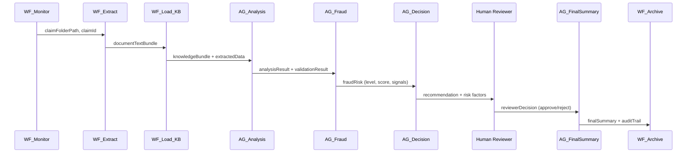

# ClaimSync

# ClaimSync — AI-Powered Insurance Claims Settlement Orchestration

> **Project Type:** UiPath Maestro BPMN Process Orchestration  
> **Process ID:** `Process_ClaimSync`  
> **Built with:** UiPath Studio Web | Agents | RPA Workflows | Human-in-the-Loop (HITL)

---

## Overview

**ClaimSync** is an end-to-end, intelligent insurance claims processing automation built on UiPath Maestro BPMN. It orchestrates a multi-stage pipeline that combines **RPA document extraction**, **AI agent analysis**, **fraud risk scoring**, **decision support**, and **human-in-the-loop review** to settle insurance claims with transparency, auditability, and confidence.

The process monitors a folder for new claim submissions, extracts and validates documents, runs AI-powered analysis and fraud detection, routes medium/high-risk claims to human reviewers, and produces a final settlement summary with a complete audit trail.

---

## Architecture



---

## Process Stages

| Stage | Component | Purpose |
|-------|-----------|---------|
| **1. Intake** | `WF_Monitor_Claim_Intake` | Discovers new claim folders from a root directory |
| **2. Initialize** | `WF_Initialize_Claim_Record` | Generates a deterministic claim ID |
| **3. Document Extraction** | `WF_Read_And_Extract_Document_Text` | Reads and extracts text from PDF, TXT, DOCX, and image files |
| **4. Knowledge Loading** | `WF_Load_Agent_Knowledge` | Loads relevant knowledge base files per agent (80K char cap) |
| **5. Business Validations** | `WF_Run_Business_Validations` | Validates claim ID, text bundle quality, and document presence |
| **6. AI Claim Analysis** | `AG_Claim_Analysis_Core` | Categorizes claim (Healthcare / Vehicle / Travel), checks eligibility, identifies missing documents |
| **7. Fraud Assessment** | `AG_Fraud_Risk` | Signal-based fraud risk scoring (0–100) with corroboration from validation warnings |
| **8. Decision Support** | `AG_Decision_Support` | Priority-ranked recommendation: Approve / Partial Approve / Reject / Request Documents |
| **9. Human Review (HITL)** | `Task_HITL_Reviewer` / `Task_HITL_FraudSpec` | Human approval gates for medium and high-risk claims |
| **10. Final Summary** | `AG_Final_Summary` | Generates settlement report, 8-step audit trail, and processing metadata |
| **11. Record Update** | `WF_Update_Claim_Record` | Aggregates all stage outputs into the final claim record |
| **12. Archive** | `WF_Archive_Claim` | Moves processed claim folder to the Archive directory |

---

## AI Agents

| Agent | Model | Role |
|-------|-------|------|
| `AG_Claim_Analysis_Core` | GPT-4o | Categorization, eligibility, document completeness |
| `AG_Fraud_Risk` | GPT-5.4 | Fraud signal detection, risk scoring, recommended action |
| `AG_Decision_Support` | GPT-4o | Settlement recommendation with confidence and rationale |
| `AG_Final_Summary` | GPT-5.4 | Audit trail generation and summary alignment |
| `AG_PDF_Extraction` | GPT-5.4 | Fallback PDF text extraction invoked by the extraction workflow |

---

## RPA Workflows

| Workflow | Type | Description |
|----------|------|-------------|
| `WF_Monitor_Claim_Intake` | RPA | Monitors `RootFolderPath` for new claim folders |
| `WF_Initialize_Claim_Record` | RPA | Creates claim ID: `CLM-<timestamp>-<folder>-<guid>` |
| `WF_Read_And_Extract_Document_Text` | RPA | Extracts text from supported files; regex-parses amounts, dates, identifiers |
| `WF_Load_Agent_Knowledge` | RPA | Selects and loads KB files per agent; caps at 80K characters |
| `WF_Load_Knowledge_File` | RPA | Utility file reader invoked by `WF_Load_Agent_Knowledge` |
| `WF_Run_Business_Validations` | RPA | Deterministic validation of claim data quality |
| `WF_Send_Missing_Document_Request` | RPA | Generates claimant-facing missing document message |
| `WF_Prepare_Reviewer_Package` | RPA | Aggregates all intermediate results for human review |
| `WF_Update_Claim_Record` | RPA | Builds final structured claim record from all stages |
| `WF_Archive_Claim` | RPA | Moves processed claim folder to `Archive/` subdirectory |

---

## Knowledge Base Files

| File | Used By | Purpose |
|------|---------|---------|
| `00_ClaimSync_Master_KB.docx` | All Agents | Master guidelines and process overview |
| `01_Fraud_Detection_KB.docx` | Fraud, Decision | Fraud signals and detection rules |
| `02_Claim_Categories_KB.docx` | Analysis, Decision | Category definitions and eligibility criteria |
| `03_Document_Requirements_KB.docx` | Analysis | Required documents per claim type |
| `04_Historical_Cases_KB.docx` | Fraud | Historical fraud patterns |
| `05_Decision_Guidelines_KB.docx` | Decision | Decision priority matrix |
| `06_Summary_Templates_KB.docx` | Final Summary | Summary format and audit trail template |

> **KB Resolution Chain:** Input path → Environment variable `CLAIMSYNC_KB_PATH` → Desktop default

---

## Key Data Flow



---

## Fraud Risk Scoring

The `AG_Fraud_Risk` agent produces a composite score (0–100) with the following tiers:

| Level | Score Range | Recommended Action |
|-------|-------------|-------------------|
| **Low** | 0 – 39 | Proceed to Decision Support |
| **Medium** | 40 – 69 | Escalate to Claims Reviewer (HITL) |
| **High** | 70 – 100 | Escalate to Fraud Specialist (HITL) |

Signals include: amount anomalies, date mismatches, sparse documents, and corroborating validation warnings.

---

## Human-in-the-Loop (HITL)

| Risk Level | Reviewer Type | Action |
|------------|---------------|--------|
| **Medium** | Claims Reviewer | Approve or Reject with notes |
| **High** | Fraud Specialist | Approve or Reject with notes |

Both HITL tasks use the `ClaimHITLApp` form with claim ID, confidence score, and fraud risk score as context.

---

## Configuration

### Input Variables

| Variable | Default | Description |
|----------|---------|-------------|
| `RootFolderPath` | `C:\Users\USER\Documents\Hackathon\Test_Claims` | Root directory to monitor for claim folders |
| `ClaimFolderPath` | (dynamic) | Resolved claim folder from intake |

### Environment Variables

| Variable | Purpose |
|----------|---------|
| `CLAIMSYNC_KB_PATH` | Override default knowledge base directory |

---

## Supported Document Types

- **PDF** — Text extraction via `AG_PDF_Extraction` agent
- **TXT** — Direct read
- **DOCX** — Direct read
- **JPG / JPEG / PNG** — Logged (OCR placeholder)

---

## Error Handling

- Per-file TryCatch in extraction — single file failures do not stop the workflow
- Gateway-based branching for validation, document completeness, fraud level, and reviewer outcome
- Structured error objects with `code`, `message`, `detail`, `category`, and `status` on all service tasks

---

## Audit Trail

The `AG_Final_Summary` agent generates an 8-step audit trail capturing:
1. Claim intake timestamp
2. Document extraction status
3. Knowledge base load status
4. Validation results
5. AI analysis outcome
6. Fraud risk assessment
7. Decision support recommendation
8. Human reviewer decision (if applicable)

---

## Project Structure

```
Claim_Sync/
├── Process.bpmn              # Main BPMN orchestration
├── Process.bpmn.bak          # Backup
├── Process.bpmn.test         # Test variant
├── Process_new.bpmn          # New variant
├── project.uiproj            # Studio Web project file
├── bindings_v2.json          # Runtime binding map
├── entry-points.json         # Entry point configuration
├── EXTRACTION_INVENTORY.md   # Full component extraction report
└── .local/                   # Local Studio Web metadata
```

---

## Getting Started

1. **Configure the root folder path** in the BPMN variables (`RootFolderPath`).
2. **Place knowledge base files** in the configured KB directory (or set `CLAIMSYNC_KB_PATH`).
3. **Ensure all RPA workflows** are published to Orchestrator with valid release keys.
4. **Ensure all AI agents** are published and their process keys are bound in `bindings_v2.json`.
5. **Run the BPMN process** — it will monitor the folder and auto-process claims end-to-end.

---

## License

© 2026 — Built for the UiPath Hackathon. All rights reserved.
