# ClaimSync — Intelligent Claims Settlement Orchestration

> **UiPath Hackathon Submission | Track 2: Agentic + Maestro Orchestration**

---

## 1. Project Description

### What ClaimSync Does

**ClaimSync** is an end-to-end, agentic automation solution that transforms insurance claims processing from a manual, error-prone task into an intelligent, auditable, and scalable pipeline. Built on **UiPath Maestro BPMN**, it orchestrates a multi-stage settlement workflow that combines **RPA document handling**, **AI agent analysis**, **fraud risk scoring**, **decision support**, and **human-in-the-loop oversight** to settle claims with speed, accuracy, and transparency.

### The Problem It Solves

Insurance claims processing today faces critical challenges:

- **Manual Bottlenecks**: Reviewers manually read, categorize, and validate every document — a slow, repetitive process that doesn't scale.
- **Inconsistent Decisions**: Without structured decision frameworks, outcomes vary across reviewers, leading to unfair settlements.
- **Fraud Blind Spots**: Fraudulent claims often slip through because manual review lacks signal-based, composite risk scoring.
- **Compliance Gaps**: Regulators demand full audit trails, but manual processes rarely capture step-by-step reasoning and human override justifications.
- **Poor Claimant Experience**: Missing documents trigger back-and-forth emails, delaying payouts and frustrating customers.

### How ClaimSync Solves It

ClaimSync replaces manual review with a **hybrid human-AI pipeline**:

1. **Auto-Discovery**: Monitors a folder for new claim submissions automatically.
2. **Smart Extraction**: Reads and extracts text from PDFs, DOCX, TXT, and images using RPA + AI fallback.
3. **AI Categorization**: Classifies claims into **Healthcare**, **Vehicle**, or **Travel** categories and checks eligibility against policy rules.
4. **Document Completeness Gate**: Automatically detects missing documents and sends claimant-facing requests — no human needed.
5. **Fraud Risk Engine**: Runs a composite fraud score (0–100) with weighted signal detection and corroborating validation evidence.
6. **Intelligent Escalation**: Routes **low-risk** claims straight to auto-decision; **medium-risk** to a Claims Reviewer; **high-risk** to a Fraud Specialist — both via Human-in-the-Loop (HITL) tasks.
7. **Decision Support**: AI generates structured recommendations (Approve / Partial Approve / Reject / Request Documents) with confidence scores and rationale.
8. **Audit-Ready Summary**: Produces a final settlement report with an 8-step audit trail, processing metadata, and UTC timestamps.
9. **Auto-Archive**: Updates the claim record and archives the folder upon completion.

The result: **80%+ reduction in manual effort**, **consistent decision quality**, **full regulatory auditability**, and **faster claimant payouts**.

---

## 2. UiPath Components

ClaimSync is built from the following UiPath products and components:

| # | Component | Type | Role in ClaimSync |
|---|-----------|------|-------------------|
| 1 | **Maestro BPMN** (`Process.bpmn`) | Process Orchestration | The central nervous system. Defines the end-to-end flow with gateways, service tasks, user tasks, and sequence flows that coordinate all RPA workflows, AI agents, and human reviewers. |
| 2 | **UiPath Orchestrator** | Platform Service | Schedules and executes RPA jobs (`StartJob`) and Agent jobs (`StartAgentJob`), manages release keys, folders, and process versions. |
| 3 | **RPA Workflows** (`.xaml` / `.cs`) | Robotic Process Automation | 8 supporting workflows handle document I/O, knowledge base loading, business validations, record updates, and archiving. |
| 4 | **Low-code Agents** (Agent Builder) | AI Agents | 4 intelligent agents — Claim Analysis, Fraud Risk, Decision Support, and Final Summary — built in UiPath Agent Builder with GPT-4o / GPT-5.4 models. |
| 5 | **Human-in-the-Loop (HITL)** | Action Center / Tasks | 2 human review gates — Claims Reviewer (medium risk) and Fraud Specialist (high risk) — presented as structured Action Center tasks with full claim context. |
| 6 | **Document Understanding / Extraction** | AI + RPA | Extracts text bundles from policy documents, ID proofs, incident reports, and supporting evidence. Uses regex parsing for amounts, dates, and identifiers with AI fallback for PDFs. |
| 7 | **Knowledge Base Loader** | RPA + File System | Dynamically loads domain-specific knowledge files (policy rules, fraud indicators, decision guidelines, summary templates) tailored to each agent stage, capped at 80K characters. |
| 8 | **Action Center** | Human Task Management | Hosts the `ClaimHITLApp` form where human reviewers approve or reject claims with structured context (claim ID, confidence score, fraud risk score). |
| 9 | **Studio Web** | Design Environment | Used to author, validate, and publish the Maestro BPMN process and manage project bindings. |
| 10 | **Integration Service / Connectors** | Connectors | (Extensible) Can be wired to email, CRM, or policy systems for outbound notifications and record sync. |

---

## 3. Agent Type

**This solution utilizes Low-code Agents.**

All four AI agents in ClaimSync (`AG_Claim_Analysis_Core`, `AG_Fraud_Risk`, `AG_Decision_Support`, `AG_Final_Summary`) are **Low-code Agents built in UiPath Agent Builder** and invoked via `Orchestrator.StartAgentJob`. They are configured with:

- **LLM Models**: GPT-4o and GPT-5.4 for reasoning, classification, and summarization.
- **Structured JSON Schema Outputs**: Strictly typed responses with confidence scores, enumerated values, and reasoning fields.
- **Knowledge-Aware Prompting**: Dynamic injection of knowledge base context per agent stage.
- **Multi-step Reasoning Chains**: Composite fraud scoring, priority-rule decision matrices, and audit trail generation.

The Low-code Agents are complemented by **RPA Workflows** for deterministic tasks (file I/O, validation, archiving) and **Maestro BPMN** for process orchestration — creating a true **Agentic Automation** architecture where AI handles judgment and RPA handles execution.

> **Note**: The solution does not use Coded Agents (Python/LangGraph). All agent logic is authored visually in Agent Builder with prompt engineering and schema constraints.

---

## 4. Process Flow (Based on `Process.bpmn`)

```mermaid
flowchart LR
    Start(["Start"]) --> Monitor["1. WF_Monitor_Claim_Intake<br/>📁 Watch folder"]
    Monitor --> Init["2. WF_Initialize_Claim_Record<br/>🆔 Generate Claim ID"]
    Init --> Gate1{"Policy Doc<br/>Available?"}
    Gate1 -->|No| End1(["❌ End"])
    Gate1 -->|Yes| Extract["3. WF_Extract_Documents<br/>📄 Read PDF/DOCX/TXT"]
    Extract --> KB1["4. WF_Load_KB<br/>📚 Analysis Context"]
    KB1 --> Analysis["5. AG_Claim_Analysis_Core<br/>🤖 Categorize + Eligibility"]
    Analysis --> Gate2{"Documents<br/>Complete?"}
    Gate2 -->|No| SendMissing["6. WF_Send_Missing_Docs<br/>📧 Notify Claimant"]
    SendMissing --> End1
    Gate2 -->|Yes| Validate["7. WF_Validations<br/>✅ Business Rules"]
    Validate --> KB2["8. WF_Load_KB<br/>📚 Fraud Context"]
    KB2 --> Fraud["9. AG_Fraud_Risk<br/>🛡️ Score 0-100"]
    Fraud --> Gate3{"Risk Level"}
    Gate3 -->|Low| KB3a["10. WF_Load_KB<br/>📚 Decision Context"]
    Gate3 -->|Medium| KB3b["10. WF_Load_KB<br/>📚 Decision Context"]
    Gate3 -->|High| KB3c["10. WF_Load_KB<br/>📚 Decision Context"]
    KB3a --> Decision1["11. AG_Decision_Support<br/>💡 Recommend"]
    KB3b --> Decision2["11. AG_Decision_Support<br/>💡 Recommend"]
    KB3c --> Decision3["11. AG_Decision_Support<br/>💡 Recommend"]
    Decision2 --> HITL1["12. HITL_Reviewer<br/>👤 Medium Risk Review"]
    Decision3 --> HITL2["12. HITL_FraudSpec<br/>👤 High Risk Review"]
    HITL1 --> Gate4{"Approve?"}
    HITL2 --> Gate4
    Gate4 -->|Reject| End1
    Gate4 -->|Approve| KB4["13. WF_Load_KB<br/>📚 Summary Context"]
    Decision1 --> KB4
    KB4 --> Summary["14. AG_Final_Summary<br/>📋 Audit Report"]
    Summary --> Update["15. WF_Update_Record<br/>💾 Persist Results"]
    Update --> Archive["16. WF_Archive_Claim<br/>📦 Move to Archive"]
    Archive --> End2(["✅ Claim Settled"])
```



### Gateway Logic Summary

| Gateway | Condition | Path |
|---------|-----------|------|
| **Policy Doc Available?** | `outIsPolicyDocumentAvailable === true` | Proceed to extraction |
| | `outIsPolicyDocumentAvailable === false` | End process |
| **Documents Complete?** | `documentsComplete === true` | Proceed to validation |
| | `documentsComplete === false` | Send missing docs request → End |
| **Risk Level** | `fraudRisk.level == "low"` | Auto-decision → Final Summary |
| | `fraudRisk.level == "medium"` | HITL Reviewer → Final Summary |
| | `fraudRisk.level == "high"` | HITL Fraud Specialist → Final Summary |
| **Reviewer Outcome** | `outDecision === "approve"` or `outDecision2 === "approve"` | Proceed to Final Summary |
| | `outDecision === "reject"` or `outDecision2 === "reject"` | End process |

---

## 5. Setup Instructions (For Judging)

### Prerequisites

Before running ClaimSync, ensure the following are in place:

1. **UiPath Cloud Tenant** with access to:
   - Maestro / Process Orchestration
   - Orchestrator (Folders, Processes, Queues, Assets)
   - Action Center (Human-in-the-Loop tasks)
   - Agent Builder (Low-code Agents)

2. **Local Machine** (Windows with UiPath Robot):
   - Claim intake folder: `C:\Users\USER\Documents\Hackathon\Test_Claims`
   - Knowledge Base folder: `C:\Users\USER\Documents\Hackathon\Knowledge Base`

3. **All Supporting Processes Published** to Orchestrator with valid release keys.

4. **All Agents Published** to Orchestrator with matching names and folder paths.

5. **Action Center App** `ClaimHITLApp` deployed and accessible to reviewer users.

---

### Step 1: Clone the Repository

```bash
git clone https://github.com/<your-org>/ClaimSync.git
cd ClaimSync
```

---

### Step 2: Prepare Local Folders

Create the following directory structure on your machine (or update `RootFolderPath` in the BPMN variables):

```
C:\Users\USER\Documents\Hackathon\
├── Test_Claims\                    # Drop new claim folders here
│   └── CLM-20260630-001\
│       ├── policy_document.pdf
│       ├── id_proof.pdf
│       ├── incident_report.pdf
│       └── medical_records.pdf   # (for Healthcare claims)
└── Knowledge Base\                  # Domain knowledge for agents
    ├── 00_ClaimSync_Master_KB.docx
    ├── 01_Fraud_Detection_KB.docx
    ├── 02_Claim_Categories_KB.docx
    ├── 03_Document_Requirements_KB.docx
    ├── 04_Historical_Cases_KB.docx
    ├── 05_Decision_Guidelines_KB.docx
    └── 06_Summary_Templates_KB.docx
```

> **Tip**: You can override the KB path by setting the environment variable `CLAIMSYNC_KB_PATH`.

---

### Step 3: Deploy RPA Workflows

For each workflow listed below:

1. Open the workflow project in **UiPath Studio**.
2. Publish to **Orchestrator** in the correct folder.
3. Note the **Release Key** and **Folder Path** — they must match the bindings in `bindings_v2.json`.

| Workflow | Suggested Folder | Purpose |
|----------|------------------|---------|
| `WF_Monitor_Claim_Intake` | `Shared/` | Folder monitoring |
| `WF_Initialize_Claim_Record` | `Shared/` | Claim ID generation |
| `WF_Read_And_Extract_Document_Text` | `Shared/` | Document extraction |
| `WF_Load_Agent_Knowledge` | `Shared/` | KB loading |
| `WF_Run_Business_Validations` | `Shared/` | Validation rules |
| `WF_Send_Missing_Document_Request` | `Shared/` | Missing doc notification |
| `WF_Prepare_Reviewer_Package` | `Shared/` | HITL context package |
| `WF_Update_Claim_Record` | `Shared/` | Record persistence |
| `WF_Archive_Claim` | `Shared/` | Folder archiving |

---

### Step 4: Deploy Low-code Agents

In **UiPath Agent Builder**:

1. Create or import the following agents with the exact names:
   - `AG_Claim_Analysis_Core`
   - `AG_Fraud_Risk`
   - `AG_Decision_Support`
   - `AG_Final_Summary`
2. Configure each agent with the appropriate **GPT model** (GPT-4o or GPT-5.4) and **JSON output schema** as defined in `Process.bpmn`.
3. Publish each agent to **Orchestrator**.
4. Ensure the agent names and folder paths match the bindings in `bindings_v2.json`.

---

### Step 5: Deploy the Maestro BPMN Process

1. Open **UiPath Studio Web**.
2. Import the `Claim_Sync` project containing `Process.bpmn`.
3. Open `bindings_v2.json` and verify every binding:
   - **Process names** and **folder paths** for each RPA workflow.
   - **Agent names** and **folder paths** for each `StartAgentJob`.
   - **Release keys** for published process versions.
4. Resolve any missing bindings (Studio Web will flag them).
5. **Publish** the BPMN process to Orchestrator.

---

### Step 6: Configure Action Center (HITL)

1. Deploy the `ClaimHITLApp` form to **Action Center**.
2. Assign users to the appropriate roles:
   - **Claims Reviewer** → receives medium-risk tasks (`SingleUser` assignment).
   - **Fraud Specialist** → receives high-risk tasks (`AllUsers` assignment).
3. Verify the form exposes:
   - Claim ID
   - Fraud Risk Score
   - Confidence Score
   - Approve / Reject actions

---

### Step 7: Run a Test Claim

#### For Low-Risk (Auto-Approved) Demo:

1. Create a folder: `C:\Users\USER\Documents\Hackathon\Test_Claims\CLM-LOW-001`
2. Add complete, clean documents:
   - Valid policy document
   - Clear ID proof
   - Supporting evidence (e.g., medical bill with consistent amounts and dates)
3. **Trigger the process** via Orchestrator by starting a job for `Process_ClaimSync`.
4. **Expected outcome**: Process completes without HITL. Check the final claim record for auto-approval.

#### For Medium-Risk (HITL Reviewer) Demo:

1. Create a folder: `C:\Users\USER\Documents\Hackathon\Test_Claims\CLM-MED-001`
2. Add documents with minor anomalies:
   - Slightly mismatched dates
   - Amounts near policy limits
3. **Trigger the process**.
4. **Expected outcome**: Process pauses at `Task_HITL_Reviewer`. Open **Action Center**, complete the review task (Approve or Reject), and watch the process resume.

#### For High-Risk (Fraud Specialist) Demo:

1. Create a folder: `C:\Users\USER\Documents\Hackathon\Test_Claims\CLM-HIGH-001`
2. Add documents with strong fraud signals:
   - Missing or sparse documents
   - Grossly inflated amounts
   - Date mismatches across files
3. **Trigger the process**.
4. **Expected outcome**: Process pauses at `Task_HITL_FraudSpec`. Open **Action Center**, review the fraud context, and complete the task.

---

### Step 8: Verify Outputs

After each run, check the following outputs:

| Output | Location | What to Verify |
|--------|----------|----------------|
| `out_ClaimRecord` | Updated record / DB | All stage results aggregated |
| `summary_report` | Agent output | Human-readable settlement summary |
| `audit_trail` | Agent output | 8-step processing history |
| `processing_metadata` | Agent output | UTC timestamps, confidence scores, fraud tier |
| Archived folder | `Test_Claims\Archive\` | Claim folder moved after completion |

---

## 6. Key Design Decisions

| Decision | Rationale |
|----------|-----------|
| **Low-code Agents over Coded Agents** | Faster iteration, visual prompt engineering, and native Orchestrator integration for hackathon delivery. |
| **Per-Stage Knowledge Loading** | Keeps agent context focused and under token limits (80K cap), improving accuracy and reducing hallucination. |
| **Structured JSON Schemas** | Enforces deterministic outputs from LLMs, enabling reliable gateway branching and audit logging. |
| **Composite Fraud Scoring** | Weighted signals + corroborating validation warnings produce more robust risk assessment than single-flag checks. |
| **HITL Only on Medium/High Risk** | Maximizes automation for low-risk claims (the majority) while preserving human judgment where stakes are high. |
| **Deterministic Claim IDs** | `CLM-<timestamp>-<folder>-<guid>` ensures uniqueness and traceability across all systems. |

---

## 7. Project Structure

```
Claim_Sync/
├── Process.bpmn                  # Main Maestro BPMN orchestration
├── Process.bpmn.bak              # Backup version
├── Process.bpmn.test             # Test variant
├── Process_new.bpmn              # Alternate process variant
├── project.uiproj                # Studio Web project descriptor
├── package-descriptor.json       # Package metadata
├── entry-points.json             # Process entry point definitions
├── entry-points.json.fixed       # Fixed entry point variant
├── bindings_v2.json              # Orchestrator bindings (critical for deployment)
├── operate.json                  # Operate deployment configuration
├── EXTRACTION_INVENTORY.md       # Full component extraction report
├── README.md                     # This file
└── .local/                       # Studio Web local metadata
```

---

## 8. Fraud Risk Tiers

| Tier | Score | Path | Human Touch |
|------|-------|------|-------------|
| **Low** | 0 – 39 | Auto-decision → Final Summary | None |
| **Medium** | 40 – 69 | Decision Support → HITL Reviewer → Final Summary | Claims Reviewer |
| **High** | 70 – 100 | Decision Support → HITL Fraud Specialist → Final Summary | Fraud Specialist |

---

## 9. License

© 2026 — Built for the UiPath Agentic Automation Hackathon. All rights reserved.

---

*For questions, issues, or demo support, please open a GitHub issue or contact the ClaimSync team.*
